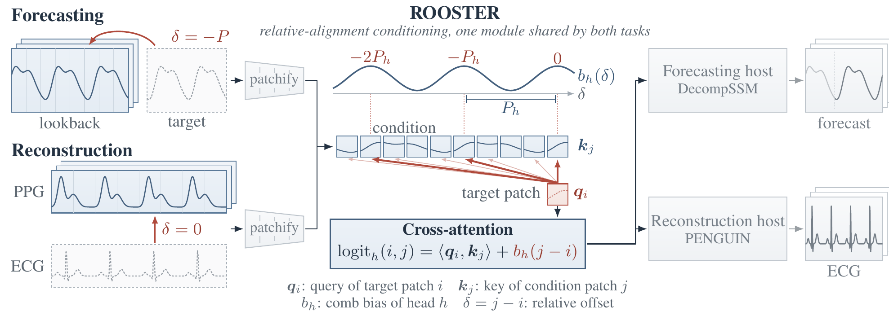

# ROOSTER

**Relative aligned conditioning for time-series forecasting and PPG-to-vital-sign reconstruction.**

Code for the paper *Learning Where to Look: A Shared Relative-Alignment
Module for Time-Series Forecasting and PPG-to-Vital-Sign Reconstruction*
(Ragamayi Puli, Shunya Nagashima; Neurogica Inc.).

<p align="center"></p>

## What it is

Long-horizon forecasting and PPG-to-vital-sign reconstruction both generate a target
sequence from a condition sequence, and both hinge on one question: *which part of the
condition should each target position read?* Forecasting models hard-code "one seasonal
period back"; reconstruction models hard-code "the sample at the same position". ROOSTER
replaces both with one learned rule: cross-attention from target patches to condition
patches whose logits carry a **periodic-comb bias** over the relative offset
`delta = j - i`,

```
logit_h(i, j) = <q_i, k_j> / sqrt(d_k) + b_h(j - i),
b_h(delta)    = -kappa_h * (1 - cos(2*pi*(delta - phi_h) / P_h)),
```

with centre `phi_h`, period `P_h` and sharpness `kappa_h` learned per head. A long
period degenerates to a single peak at the same position (what reconstruction needs); a
short period puts peaks one, two, ... seasons back (what forecasting needs). The learned
`(phi_h, P_h)` are logged for every run, so the model reports which correspondence it
found: about one day on 15-minute data, the identity on waveform reconstruction, and no
period on exchange rates, the one dataset where the module does not help.

The module is inserted, with a zero-initialised output projection, into two hosts from
our earlier work: [DecompSSM](https://arxiv.org/abs/2602.05389) for forecasting and
[PENGUIN](https://arxiv.org/abs/2602.03858) for reconstruction. An untrained module leaves
either host unchanged.

The name: a rooster has a comb, and it crows at the same time every day.

## Results

PPG-to-vital-sign reconstruction, PENGUIN's metric protocol (lower is better):

| Task | Metric | Strongest published | ROOSTER |
|---|---|---|---|
| PPG-DaLiA | HR error (bpm) | 15.64 | **9.77** |
| WildPPG | HR error (bpm) | 12.97 | **11.26** |
| BIDMC | RR error (bpm) | 2.98 | **1.65** |
| WESAD | RR error (bpm) | 4.45 | **3.65** |

Forecasting, MSE / MAE averaged over horizons, DecompSSM's protocol (lookback 96):

| Dataset | DecompSSM (published) | ROOSTER |
|---|---|---|
| ECL | 0.167 / 0.261 | **0.166** / 0.261 |
| Weather | 0.242 / **0.270** | **0.240** / 0.271 |
| ETTm2 | 0.280 / **0.320** | **0.279** / 0.324 |
| PEMS04 | 0.103 / 0.212 | **0.100** / **0.211** |

Under one harness with three seeds per model, ROOSTER has lower mean MSE than retrained
DecompSSM on 20 of 24 dataset-horizon settings over six datasets. All numbers, the
ablation study and the error analysis are in the paper.

## Install

```bash
git clone https://github.com/Neurogica/ROOSTER.git && cd ROOSTER
python -m venv .venv && source .venv/bin/activate
pip install -e ".[dev]"
pytest tests -q
```

Python 3.11+, PyTorch 2.8+, one GPU. Datasets are not included; see
[`data/README.md`](data/README.md) for sources and the expected layout.

## Reproduce the paper

| Table | Script |
|---|---|
| Table 1 (reconstruction, PENGUIN protocol) | `scripts/reproduce_table1_reconstruction.sh` |
| Table 2 (forecasting, published protocol) | `scripts/reproduce_table2_forecasting.sh` |
| Table 3 (ablation study, both tasks) | `scripts/reproduce_table3_ablation.sh` and `scripts/reproduce_table4_reconstruction.sh` |
| Table 4 (matched-harness control vs. PENGUIN) | `scripts/reproduce_table4_reconstruction.sh` |
| Sec. 4.3 (matched harness vs. DecompSSM, 3 seeds) | `scripts/reproduce_harness_forecasting.sh` |

Every run appends one JSON record per (model, dataset, horizon, seed) to
`results/*.jsonl`; forecasting runs also refresh `LEADERBOARD.md`. A quick wiring check:

```bash
python scripts/run.py --smoke --models DecompDict-K3-q1-align --datasets ETTm2 --horizons 96 --skip-reconstruct
```

## Using the module on its own

```python
import torch
from rooster import RelativeAlignedContext

module = RelativeAlignedContext(d_model=128, n_heads=4)            # periodic-comb bias, learned per head
condition = torch.randn(8, 24, 128)                                # (batch, condition patches, d_model)
target    = torch.randn(8, 12, 128)                                # (batch, target patches, d_model)
context, weights = module(condition, target)                       # context: (8, 12, 128), zero at init

# the read-out: where the module learned to look
centre    = module.offset_centre                                   # phi_h, in patches
period    = module.log_period.exp()                                # P_h, in patches
sharpness = module.log_sharpness.exp()                             # kappa_h
mean_offset = module.dominant_offsets(weights)                     # attention-weighted mean offset per target patch
```

`rooster/models/aligned_context.py` is self-contained (PyTorch only). The two hosts are
`rooster/models/decomp_dict.py` (forecasting) and `rooster/models/flow_ssm.py`
(reconstruction); every configuration used in the paper is listed in
`rooster/models/configs.py`.

## Repository layout

```
rooster/
  models/aligned_context.py   the module (relative aligned conditioning)
  models/decomp_dict.py       forecasting host (DecompSSM-derived)
  models/flow_ssm.py          reconstruction host (PENGUIN-derived, flow matching)
  models/configs.py           the paper's configurations, by leaderboard name
  models/baselines/           DecompSSM, PENGUIN, DLinear and sanity baselines; training loop
  models/vendor/              DecompSSM and PENGUIN reference code (our earlier releases)
  datasets/                   forecasting and physiological loaders, splits, windows
  evaluation/                 metrics (MSE/MAE, Hamilton HR, Fourier RR), harness, records
scripts/                      run.py (forecasting), run_reconstruction.py, reproduce_*.sh
tests/                        unit tests for the module, hosts, metrics and loaders
```

## Citation

```bibtex
@misc{puli2026rooster,
  title  = {Learning Where to Look: A Shared Relative-Alignment Module for Time-Series
            Forecasting and {PPG}-to-Vital-Sign Reconstruction},
  author = {Puli, Ragamayi and Nagashima, Shunya},
  year   = {2026}
}
```

## License

BSD-3-Clause-Clear. See [LICENSE](LICENSE).
